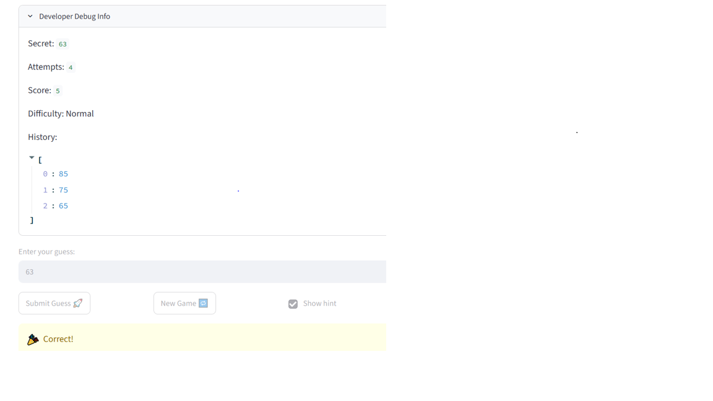

# 🎮 Game Glitch Investigator: The Impossible Guesser

## 🚨 The Situation

You asked an AI to build a simple "Number Guessing Game" using Streamlit.
It wrote the code, ran away, and now the game is unplayable. 

- You can't win.
- The hints lie to you.
- The secret number seems to have commitment issues.

## 🛠️ Setup

1. Install dependencies: `pip install -r requirements.txt`
2. Run the broken app: `python -m streamlit run app.py`

## 🕵️‍♂️ Your Mission

1. **Play the game.** Open the "Developer Debug Info" tab in the app to see the secret number. Try to win.
2. **Find the State Bug.** Why does the secret number change every time you click "Submit"? Ask ChatGPT: *"How do I keep a variable from resetting in Streamlit when I click a button?"*
3. **Fix the Logic.** The hints ("Higher/Lower") are wrong. Fix them.
4. **Refactor & Test.** - Move the logic into `logic_utils.py`.
   - Run `pytest` in your terminal.
   - Keep fixing until all tests pass!

## 📝 Document Your Experience


* **Purpose:** The Game Glitch Investigator project demonstrates how to debug, refactor, and test an AI-generated Streamlit number guessing game using GitHub Copilot and pytest.

* **Bugs Found:**

  * The game displayed reversed hint messages ("Go HIGHER!" when the guess was too high and "Go LOWER!" when the guess was too low).
  * The secret number was converted to a string on even-numbered attempts, causing incorrect comparisons.
  * The original starter tests no longer matched the updated `check_guess()` function after refactoring because the function returned a tuple instead of a single string.

* **Fixes Applied:**

  * Refactored the `check_guess()` function from `app.py` into `logic_utils.py`.
  * Corrected the higher/lower hint logic.
  * Removed the unnecessary string conversion and `TypeError` fallback.
  * Added regression tests, updated the original starter tests, and verified the repairs using `pytest` and manual testing in Streamlit.

---
## 📸 Demo Walkthrough

Describe your fixed game in numbered steps so a reader can follow along without watching a video:

1. Launch the application using `python -m streamlit run app.py`.
2. Open the **Developer Debug Info** panel to view the secret number and monitor the game state.
3. Enter a guess greater than the secret number. The game correctly displays **"Go LOWER!"** and updates the score.
4. Enter a guess lower than the secret number. The game correctly displays **"Go HIGHER!"** and records the guess in the game history.
5. Continue guessing until the correct number is entered. The game displays **"Correct!"**, celebrates the win, updates the final score, and records the completed game session.

----
## Screenshot 



----
## 🧪 Test Results

PS C:\Users\OWNER\Documents\GitHub\ai110-module1show-gameglitchinvestigator-starter> python -m pytest
rootdir: C:\Users\OWNER\Documents\GitHub\ai110-module1show-gameglitchinvestigator-starter
plugins: anyio-4.14.0
collected 6 items                                                                                

tests\test_game_logic.py ......                                                            [100%]

======================================= 6 passed in 0.07s 
=======================================

```


## 🚀 Stretch Features

- [ ] [If you choose to complete Challenge 4, describe the Enhanced UI changes here — a screenshot is optional]
